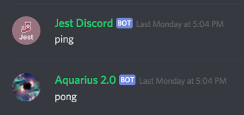

# jest-discord

A work in progress Jest plugin to work with [discord.js](https://discord.js.org/). This will spin up a test bot that you can use to send test messages to a server and react to your bot's responses. In practice, it may look something like this:



```javascript
describe('Ping', () => {
  test('response', async () => {
    const response = await prompt('ping');
    expect(response).toBeMessage('pong');
  });
});
```

## Usage

**This section is subject to extreme changes while the packages are developed and finalized!**

_There are two packages that are part of this system - `packages/jest-discord` includes the matcher and the logic for the test bot, and `packages/jest-environment-discord` includes the code to create a custom Jest environment._


## Discord

You'll first need to create a Bot and Guild on Discord in order to use this project. The test bot will need admin permissions on the guild. You should then add the bot you'd like to test.

When running your tests, you'll need to have your bot running in a separate process.

The test bot will automatically create a unique test channel to run your tests in, and delete the channel when the test suite is finished.

## Code

```
$ npm install jest-discord jest-environment-discord --save-dev
```

Or

```
$ yarn add jest-discord jest-environment-discord --dev
```

You'll then need to tell Jest to use the Discord Environment - in your `jest.config.json` file, add the following parameters:

```json
{
  "testEnvironment": "jest-environment-discord",
  "testEnvironmentOptions": {
    "testGuildId": "<GUILD_ID>"
  },
  "globalSetup": "./test.global.js",
  "setupTestFrameworkScriptFile": "./test.js",
  "roots": [
    "src/"
  ]
}

```

_Replace `<GUILD_ID>` with the ID of your test guild_

This tells Jest to load up the `jest-environment-discord` package for each test file, and tells the environment what Discord Guild to use as a test guild.

Your `./test.js` file should import the custom matchers:

```javascript
require('jest-discord/expect');
```

And your `./test.global.js` should set your environmental variables.

 **jest-discord expects a `process.env.TEST_BOT_TOKEN` variable!** The token provided will be used to control the test bot. Without one, the test suite cannot run.

## API

### Test Bot

###### async prompt(str) => Discord.Message

Sends a message to a dedicated test channel. Returns a discord.js Message object that contains your bot's response. Will timeout and fail after 6 seconds.

### Matchers

###### toBeMessage(str)

Checks to see if the received message matches the given string exactly (uses `.cleanContent` from `discord.js`)

###### toHaveEmbed

Checks to see if the message has one or more embeds

# TODO

- [ ] Installation / Usage
- [ ] Documentation
- [ ] Simple Examples
- [ ] Figure out how to have multiple connections
- [ ] Figure out how to spawn a test instance of the real bot
- [ ] Additional Matchers
- [ ] Write Package READMEs
